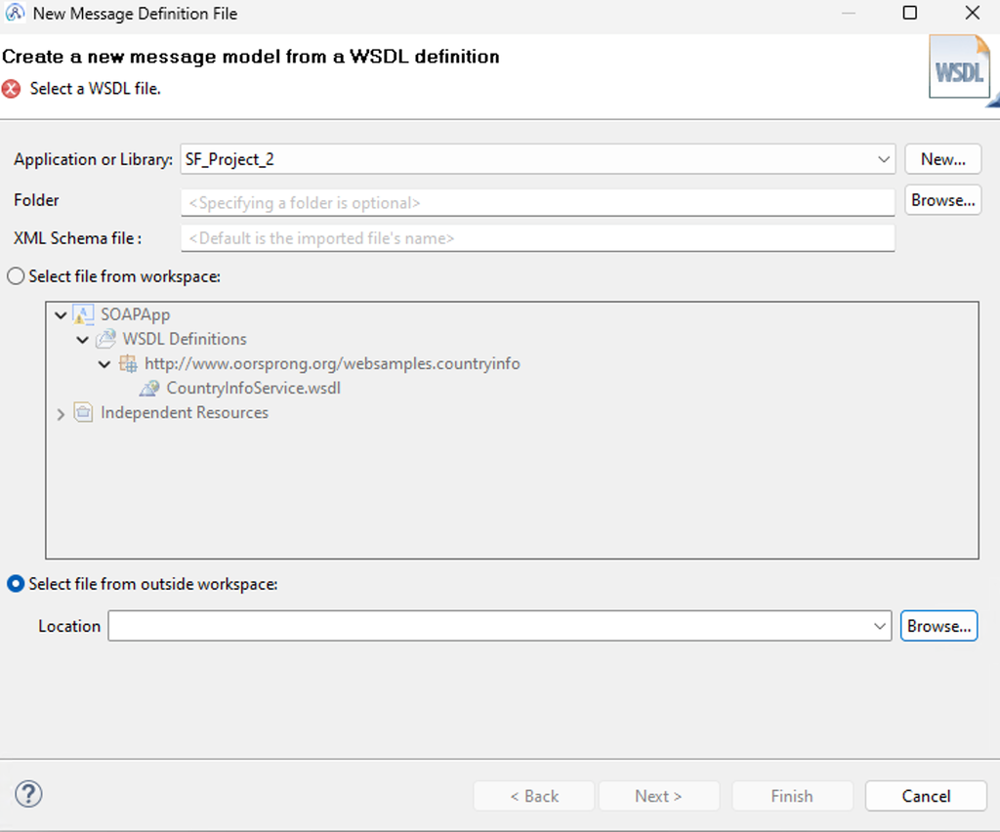

# incubation-app-connect

# Lab 1: Create WebService Using App Connect Toolkit

This document gives step-by-step guide to create WebService using App Connect Toolkit

### 1. Select SOAP Node
Select a SOAP node in the message flow. The Operation mode section opens in Properties, in the Basic tab.

### 2. Select WSDL File on SOAP Node
Click Browse to select the WSDL file. In the WSDL Selection window, click Import/Create New.

### 3. Select file
Select the WSDL file from your local file system

